<p align="center">
  
</p>

# Restaurant Order Management System

**Group 76 | PUSL2021 Computing Group Project | Plymouth University**

A web-based application that allows small restaurant owners to manage customer orders digitally. Customers scan a QR code on their table to view the menu and place orders. Orders appear on the owner's dashboard in real time.

**Live Demo:** https://restaurant-order-system-60d43.web.app

---

## Screenshots

### Customer Side

| Order Form | Order Placed | Order Confirmed |
|:---:|:---:|:---:|
| 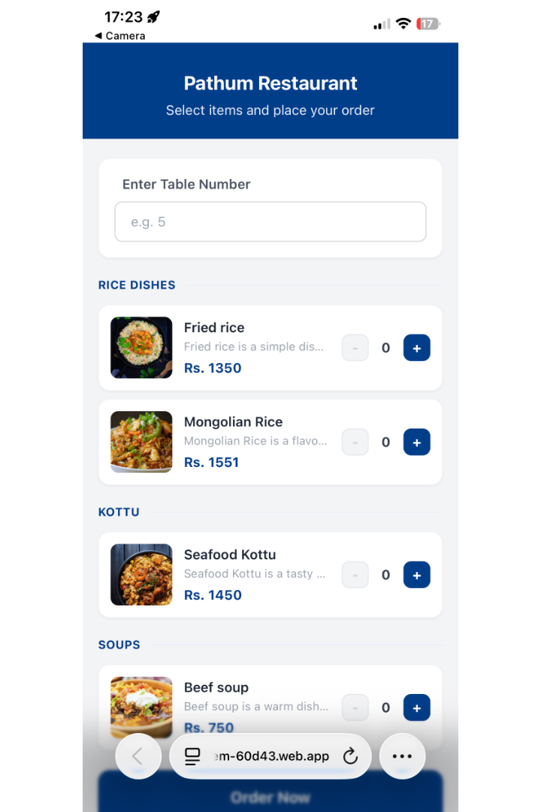 | 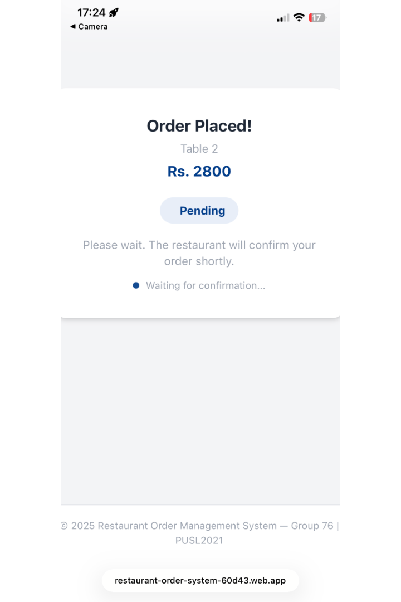 | 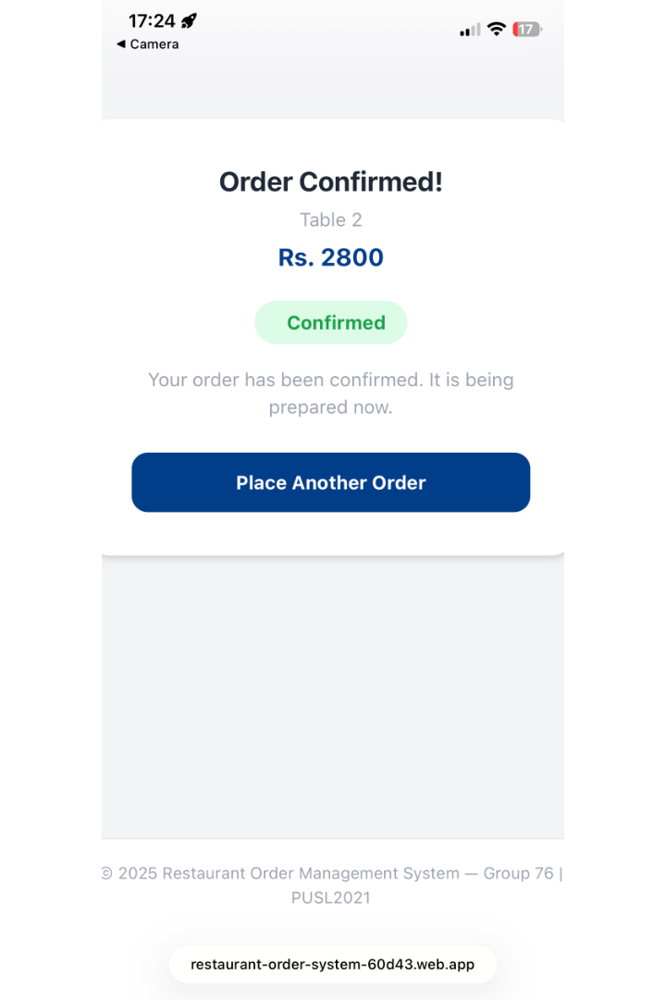 |

### Owner Dashboard

| Login | Register | Orders |
|:---:|:---:|:---:|
| 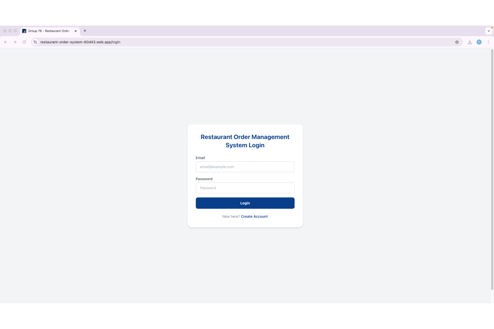 | 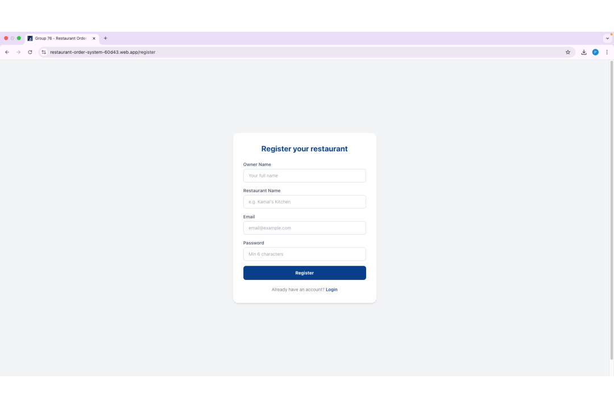 | 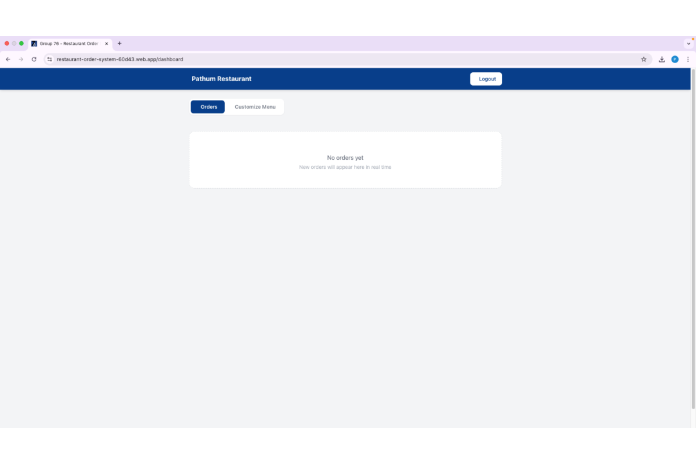 |

| Menu Management | Add Item | QR Code |
|:---:|:---:|:---:|
| 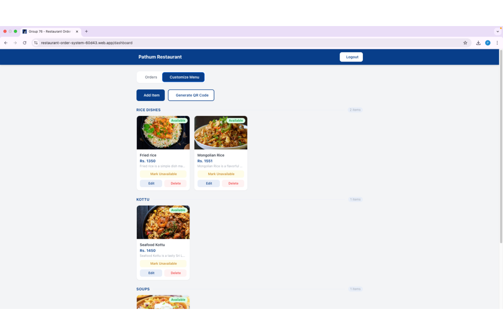 | 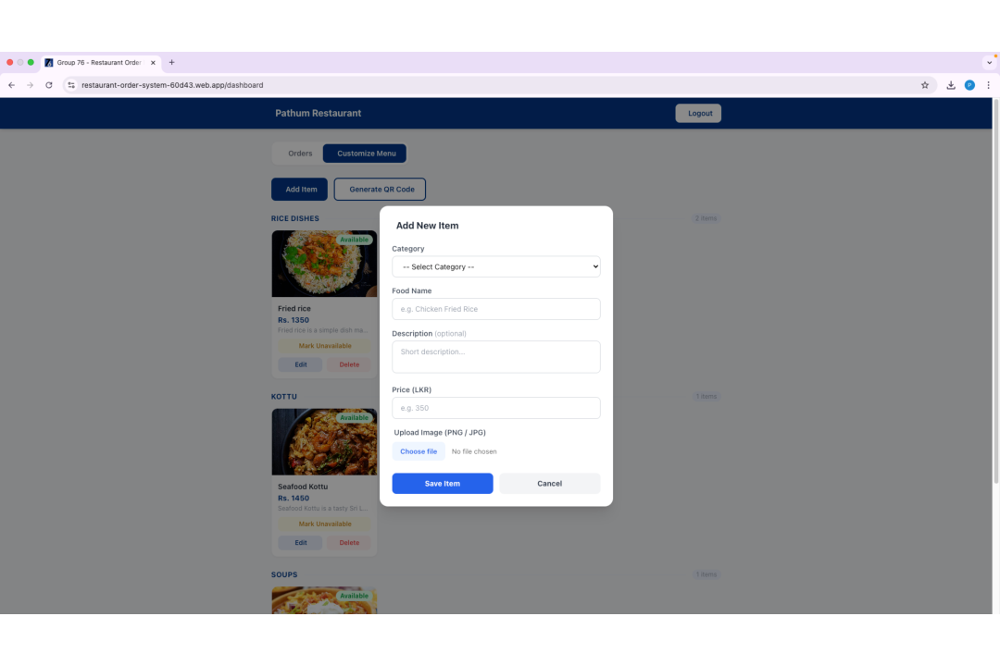 | 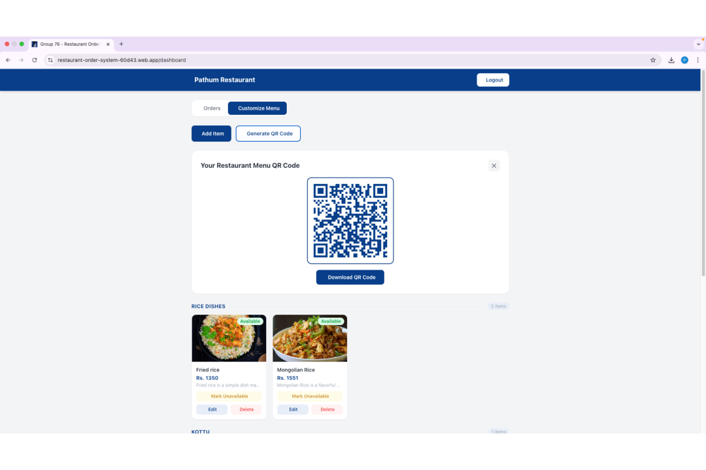 |

| New Order Notification | Order Confirmed |
|:---:|:---:|
| 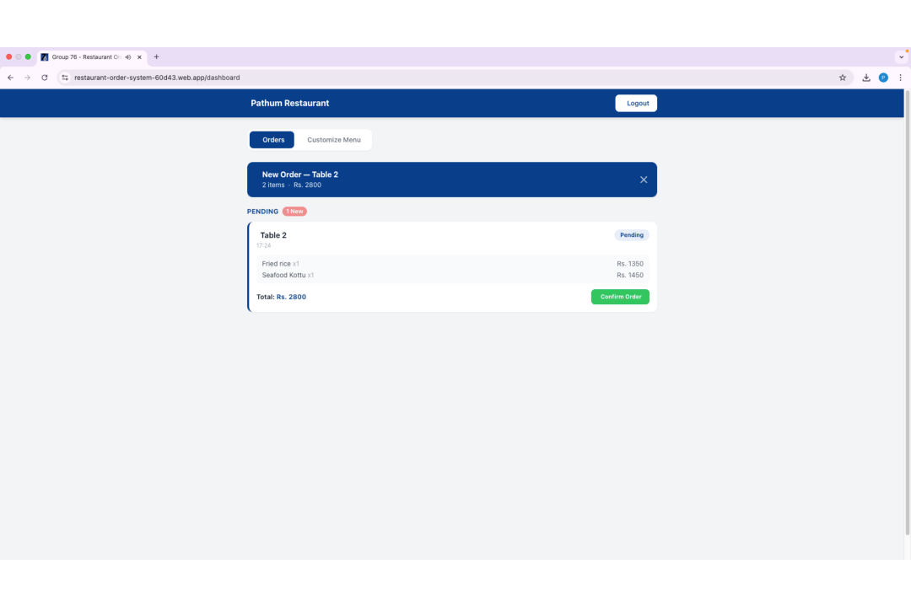 | 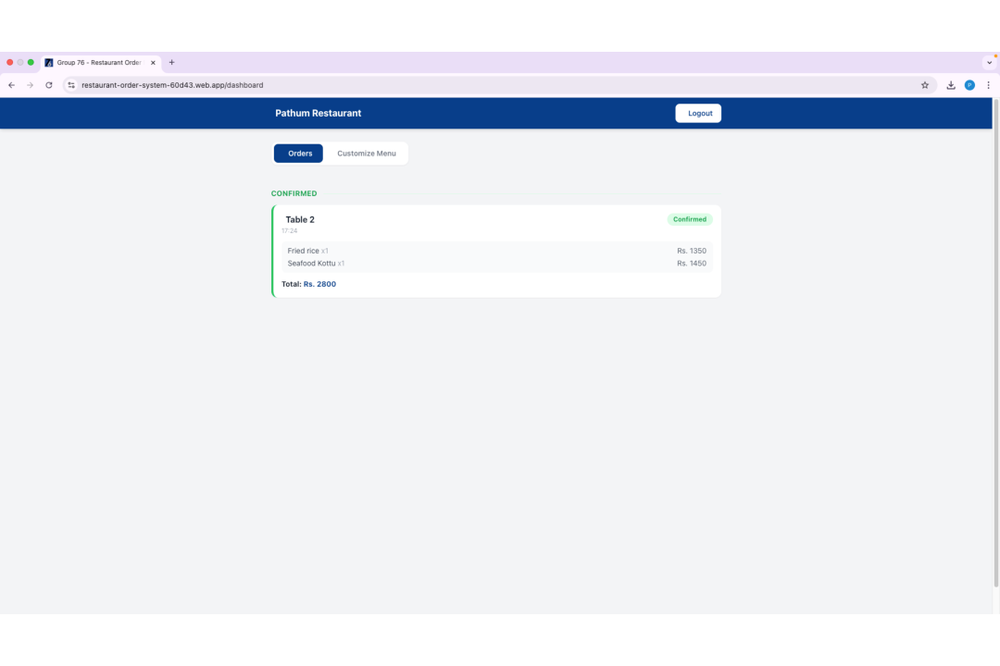 |

---

## Features

- Owner registration and login with Firebase Authentication
- Menu management — add, edit, delete items with images, prices and categories
- Automatic QR code generation per restaurant, downloadable as PNG
- Customer order form — no login or app installation required
- Real-time order notifications on owner dashboard with audio alert
- Order confirmation with status update reflected on customer screen
- Data isolation between restaurants via Firestore security rules

---

## Tech Stack

| Layer | Technology |
|---|---|
| Frontend | React.js v19 |
| Routing | React Router DOM v7 |
| Backend | Node.js with Express |
| Database | Firebase Firestore |
| Authentication | Firebase Authentication |
| File Storage | Firebase Storage |
| QR Code | qrcode.react v4 |
| Styling | Tailwind CSS v3 |
| Hosting | Firebase Hosting |

---

## Project Structure

```
src/
├── App.js
├── index.js
├── firebase/
│   └── firebaseConfig.js
├── context/
│   └── AuthContext.js
├── pages/
│   ├── LoginPage.js
│   ├── RegisterPage.js
│   └── DashboardPage.js
├── components/
│   ├── Navbar.js
│   ├── Layout.js
│   ├── Footer.js
│   ├── MenuTab.js
│   ├── MenuItemCard.js
│   ├── AddItemModal.js
│   ├── OrdersTab.js
│   ├── OrderCard.js
│   └── QRCodeDisplay.js
└── customer/
    └── CustomerOrderPage.js
```

---

## Setup

### Prerequisites

- Node.js v18 or later
- npm
- Firebase account (free Spark plan)

### Installation

```bash
git clone https://github.com/mahamalagepathum/restaurant-order-system.git
cd restaurant-order-system
npm install
```

### Firebase Configuration

Create a `.env` file in the project root:

```
REACT_APP_FIREBASE_API_KEY=your_api_key
REACT_APP_FIREBASE_AUTH_DOMAIN=your_project.firebaseapp.com
REACT_APP_FIREBASE_PROJECT_ID=your_project_id
REACT_APP_FIREBASE_STORAGE_BUCKET=your_project.appspot.com
REACT_APP_FIREBASE_MESSAGING_SENDER_ID=your_sender_id
REACT_APP_FIREBASE_APP_ID=your_app_id
```

### Run

```bash
npm start
```

---

## Database Structure

```
restaurants/
  {restaurantId}
    ownerName, shopName, email, createdAt

menuItems/
  {itemId}
    restaurantId, itemName, category, price,
    description, imageUrl, isAvailable, createdAt

orders/
  {orderId}
    restaurantId, tableNumber, items[],
    totalPrice, status, createdAt
```

---

## Team

| Name | Student ID | Responsibilities |
|---|---|---|
| Mahamalage Perera | 10968730 | Frontend, Firestore integration, QR code, real-time notifications, customer order form |
| Anjula Wijeyaratne | 10968469 | Firebase Authentication, Firebase Storage, backend, order confirmation, deployment |
| Kevan Fernando | 10952735 | Testing, development support, report writing and documentation |

---

## Module Details

| | |
|---|---|
| Module | PUSL2021 Computing Group Project |
| Programme | SE / CS / DS / TM |
| Supervisor | Mr. Diluka Wijesinghe |
| Institution | In Partnership with Plymouth University |
| Academic Year | 2024 / 2025 |
